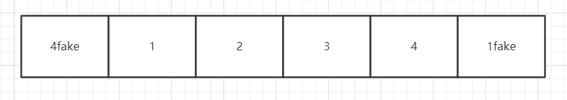

# 原生JS手写无缝无限轮播 carousel :star:
## 原理


本例 固定为4张图的轮播图,主要为便于阐述原理.在编程时可以动态加载图片.
1. 首先页面布局,重点实现如上图所示的滚动内容(board)结构
   - `4fake`的图片`4`的复制,`1fake`的图片`1`的复制,
2. 通过设置上述滚动结构(board)的css left和transition 实现滚动效果
3. 实现无限滚动 
   - 当页面滚动到`1fake` 时,在滚动完成后,将left值设置到`1`的位置(此处没有动画,用户无法察觉);
   - 同理,当页面滚动到`4fake` 时,在滚动完成后,将left值设置到`4`的位置(此处也没有动画);

### 1. 页面布局

```html
<style>
    body {
        box-sizing: border-box;
    }

    .carousel {
        position: relative;
        width: 400px;
        height: 300px;
        overflow: hidden;
    }

    .carousel-board {
        position: relative;
        list-style: none;
        width: 5000px;
        height: 300px;
        padding: 0;
        left: 0;
        /* transition: left 0.5s linear; */

    }

    .carousel-board-item {
        float: left;
        width: 400px;
        height: 300px;
        line-height: 300px;
        text-align: center;
        font-size: 30px;
    }

    .carousel-btn {
        position: absolute;
        z-index: 100;
        cursor: pointer;
    }

    .carousel-prev {
        top: 50%;
        left: 10px;
    }

    .carousel-next {
        top: 50%;
        right: 10px;
    }

    .carousel-dots {
        padding: 0;
        /* width: 100px; */
        list-style: none;
        position: absolute;
        bottom: 10px;
        left: 50%;
        margin-left: -24px;
        z-index: 100;
    }

    .carousel-dots li {
        float: left;
        width: 8px;
        height: 8px;
        background-color: #aaa;
        margin-right: 4px;
        border-radius: 4px;
        cursor: pointer;
    }
</style>
```

```html
<div class="carousel">
    <ul class="carousel-board">
        <li class="carousel-board-item" style="background-color:green">4</li>
        <li class="carousel-board-item" style="background-color:red">1</li>
        <li class="carousel-board-item" style="background-color:yellow">2</li>
        <li class="carousel-board-item" style="background-color:blue">3</li>
        <li class="carousel-board-item" style="background-color:green">4</li>
        <li class="carousel-board-item" style="background-color:red">1</li>
    </ul>
    <span class="carousel-btn carousel-prev"><</span>
    <span class="carousel-btn carousel-next">></span>
    <ul class="carousel-dots">
        <li date-index="1"></li>
        <li date-index="2"></li>
        <li date-index="3"></li>
        <li date-index="4"></li>
    </ul>
</div>
```

### 2. 点击prev和next 实现简单的左右滑动
```js
(function(){
    let prev=document.getElementsByClassName("carousel-prev")[0];
    let next=document.getElementsByClassName("carousel-next")[0];
    let board=document.getElementsByClassName("carousel-board")[0]
    prev.addEventListener("click",function(){
       animate(-400)
    })
    next.addEventListener("click",()=>{
       animate(400)
    })
    function animate(width = 400) {
        board.style.transition = "0.5s";
        board.style.left || (board.style.left = 0)
        board.style.left = parseInt(board.style.left) + width + "px";
    }
})()
```

### 3 实现无缝轮播
> 改造一下js,当到达`4fake`的位置,默默切换到`4`,到达`1fake`的位置,默默切换到`1`
```js
(function () {
    let prev = document.getElementsByClassName("carousel-prev")[0];
    let next = document.getElementsByClassName("carousel-next")[0];
    let board = document.getElementsByClassName("carousel-board")[0];
    let panels = Array.from(document.getElementsByClassName('carousel-board-item'));
    board.style.left = "-400px";
    let index = 1; //设置默认的index值
    prev.addEventListener("click", function () {
        index++
        console.log(index);
        animate(-400);
        //关键点 如果当前在 1fake 的位置
        if (index === panels.length - 1) {
            setTimeout(() => {
                //去掉动画
                board.style.transition = "0s";
                let distance = 4 * 400
                //默默的左移board至 1
                board.style.left = parseInt(board.style.left) + distance + "px"
            }, 600)
            index = 1;
        }

    })
    next.addEventListener("click", () => {
        index--
        console.log(index);
        animate(400);
        //关键点 如果当前在 4fake 的位置
        if (index === 0) {
            setTimeout(() => {
                // 去掉动画
                board.style.transition = "0s";
                let distance = -4 * 400
                //默默的右移board 至 4
                board.style.left = parseInt(board.style.left) + distance + "px"
            }, 600)
            index = 4;
        }
    })

    function animate(width = 400) {
        board.style.transition = "0.5s";
        board.style.left || (board.style.left = 0)
        board.style.left = parseInt(board.style.left) + width + "px";
    }
})()
```
## todo
1. 添加自动播放的动画;
2. 小圆点(index) 根据panel进行突出显示;
3. 点击小圆点切换panel;


## reference
1. [无缝轮播](https://github.com/Advanced-Frontend/Daily-Interview-Question/issues/108)
2. [纯手写js教你实现基础轮播图加原理](https://zhuanlan.zhihu.com/p/40516156)
3. [简单轮播](http://htmlpreview.github.io/?https://github.com/FoooooooF/handmade_javascript/blob/master/component/carousel/index_package.html)