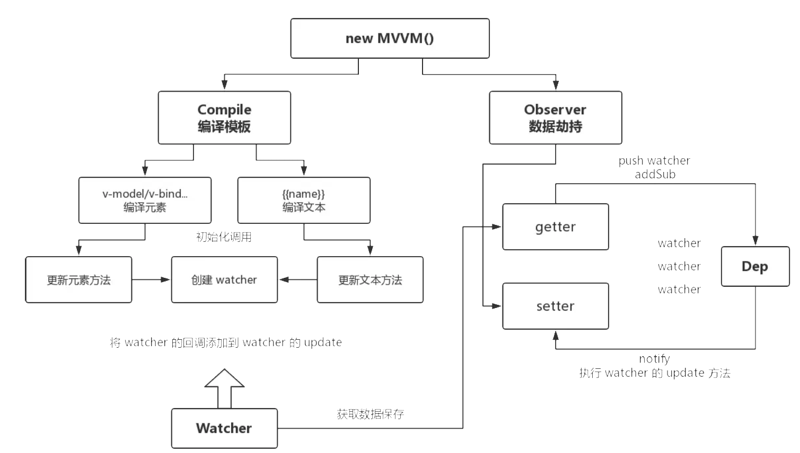
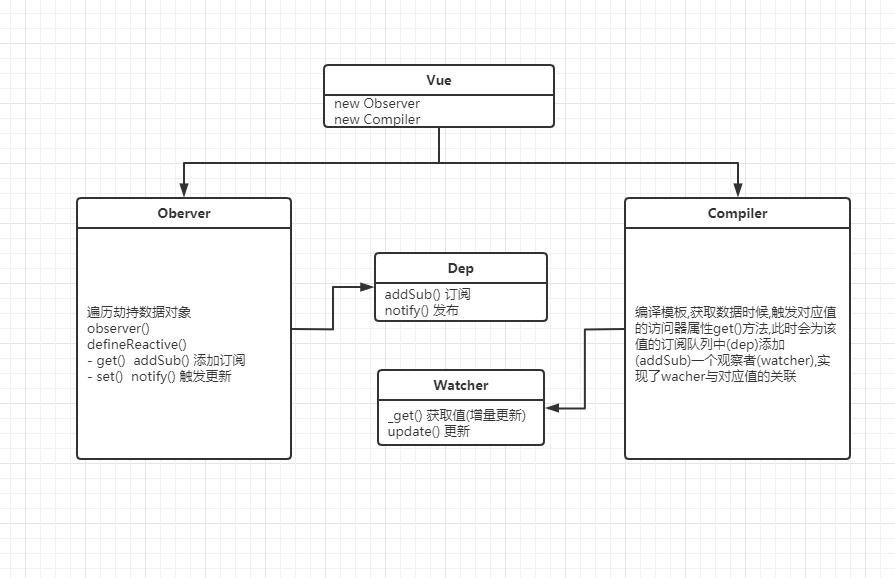

# MVVM 框架




## 响应式核心原理

1. 遍历数据劫持
2. 数据更新方法与值的关联

编译模板时获取数据(data),触发对应值的访问器属性 get()方法,此时会为该值的订阅队列中(dep)添加(addSub)一个观察者(watcher),实现了 watcher 与对应值的关联,
当值发生变化时,触发对应的 watchers(update()),页面得到更新;

## 观察者模式

- 添加观察者,触发观察者操作(重点)

## 一个简单的观察者模式

```js
// 观察者
class Watcher {
  constructor(cb) {
    this.cb = cb;
  }
  update() {
    this.cb();
  }
}
//观察者队列
class Dep {
  constructor() {
    this.subs = [];
  }
  addSub(cb) {
    this.subs.push(cb);
  }
  notify() {
    this.subs.forEach((watcher) => {
      watcher.update();
    });
  }
}
//触发
let d = new Dep();
d.addSub(
  new Watcher(() => {
    console.log(1);
  })
);
d.addSub(
  new Watcher(() => {
    console.log(2);
  })
);
d.addSub(
  new Watcher(() => {
    console.log(3);
  })
);
d.notify();
d.notify();

let d2 = new Dep();
d2.addSub(
  new Watcher(() => {
    console.log(11);
  })
);
d2.notify();
```

## 参考

[聊聊对 Vue.js 框架的理解](https://mp.weixin.qq.com/s/7kbbLah-kcCRArNHUm3lpg)
