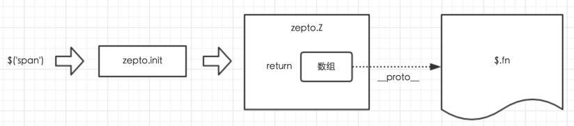

# JQuery 实现
> 简单实现JQuery



```js
var Zepto = (function(){
    var $,
        zepto = {}
    
    // ...省略N行代码...
    
    zepto.Z = function(dom, selector) {
      dom = dom || []
      dom.__proto__ = $.fn
      dom.selector = selector || ''
      return dom
    }
    
    zepto.init = function(selector, context) {
        var dom
        
        // 针对参数情况，分别对dom赋值
        
        // 最终调用 zepto.Z 返回的数据
        return zepto.Z(dom, selector)
    }
    
    $ = function(selector, context){
        return zepto.init(selector, context)
    }
    
    $.fn = {
        // 里面有若干个工具函数
    }
    
    // ...省略N行代码...
    
    return $
})()
zepto.Z.prototype = $.fn
window.Zepto = Zepto
window.$ === undefined && (window.$ = Zepto)
```


# 参考
1. [jQuery源码解析（架构与依赖模块）](https://www.imooc.com/learn/172)
2. [zepto设计和源码分析](https://www.imooc.com/learn/745)
3. [zepto对象思想与源码分析 :star:](http://www.kancloud.cn/wangfupeng/zepto-design-srouce/173680)
4. [创建你的第一个JavaScript库](http://www.admin10000.com/document/1069.html)
5. [zepto设计和源码分析](https://my.oschina.net/u/3018050/blog/1790725)
