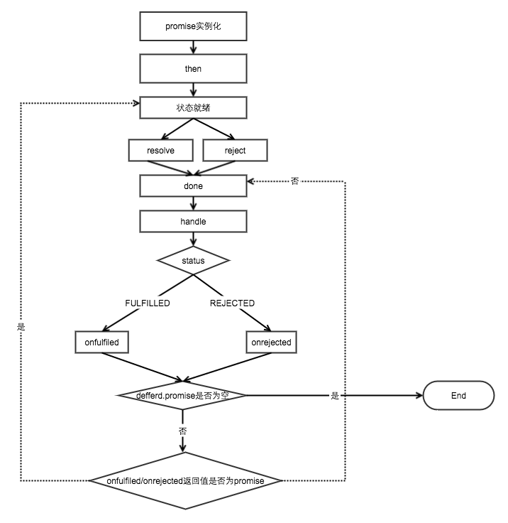

# handmade promsie
## 步骤
1. 创建Promsie类
2. 创建constractor构造函数
3. 实现原型then方法和then的链式调用
4. 实现Promsie对象方法 resolve,reject,race,all
## promsie流程图

## 详细步骤
[BAT前端经典面试问题：史上最最最详细的手写Promise教程 ⭐](https://juejin.im/post/5b2f02cd5188252b937548ab)

## 理解
1. new Peomise 传入一个exuctor(执行函数),执行函数有两个形参,resole和reject.
2. resole和reject是两个回调函数,这两个函数的函数体已经在Promsie构造函数中定义,
   它们只用于改变Promsie实例的状态.
   pending->fullfiled 等待->完成
   pending->rejected  等待->失败
   且过程不可逆
3. Promise 原型上定义有then方法,then方法可以传两个参数,
   分别是onResolved(成功的回调)和onRejected(失败的回调),
   then方法监听Promsie 实例的状态,当状态改变时,调用相应的回调方法.
   (then方法是如何监听 实例的状态变化的?)
4. 待理解:then的链式调用,then的穿透,then方法中继续返回Promsie

## Promise 的链式调用
```
promise().then(suc1)
```
为了讨论问题的简便,只讨论`成功`的链式调用情况
1. 首先调用`promise()`方法会返回一个promise实例(promise1)
2. then方法会实例化一个Promise对象(promise2)
3. then方法会将suc1和promise2中的resolve方法组合为一个函数(SucCb1),推入promise1的成功回调队列
4. promise1中的状态变为成功时,执行成功对列中的函数(SucCb1)
5. SucCb1的执行过程
   - 执行suc1,获取suc1返回值(res)
   - 如果res不是一个Promise对象,执行promise2中的resolve(res),触发Promise2的成功回调队列
   - 如果res是一个Promise对象(promise3),直接调用promise3.then(suc2),__卡住了__


## reference
- [BAT前端经典面试问题：史上最最最详细的手写Promise教程 ⭐](https://juejin.im/post/5b2f02cd5188252b937548ab)
- [图解 Promise 实现原理（二）—— Promise 链式调用 ⭐](https://zhuanlan.zhihu.com/p/102017798)
- [30分钟，让你彻底明白Promise原理](https://mengera88.github.io/2017/05/18/Promise%E5%8E%9F%E7%90%86%E8%A7%A3%E6%9E%90/)
- [手写Promise——彻底明白Promise原理](https://blog.csdn.net/qq_22167989/article/details/81586105)
- [深入理解 Promise (中)](http://coderlt.coding.me/2016/12/04/promise-in-depth-an-introduction-2/)
- [30分钟，让你彻底明白Promise原理](https://mengera88.github.io/2017/05/18/Promise%E5%8E%9F%E7%90%86%E8%A7%A3%E6%9E%90/)