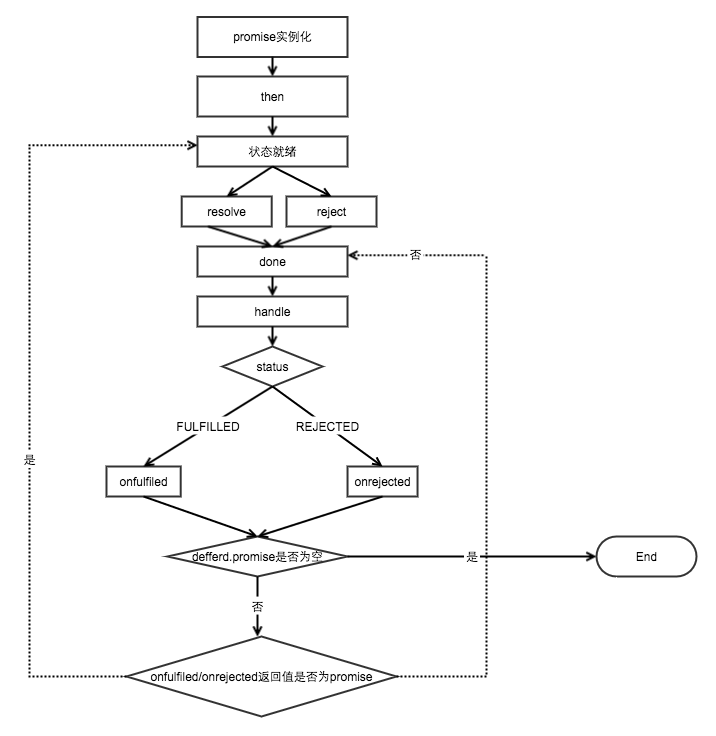

# handmade promsie
## 步骤
1. 创建Promsie类
2. 创建constractor构造函数
3. 实现原型then方法和then的链式调用
4. 实现Promsie对象方法 resolve,reject,race,all
## promsie流程图

##详细步骤
[BAT前端经典面试问题：史上最最最详细的手写Promise教程 ⭐](https://juejin.im/post/5b2f02cd5188252b937548ab)

## reference
- [BAT前端经典面试问题：史上最最最详细的手写Promise教程 ⭐](https://juejin.im/post/5b2f02cd5188252b937548ab)
- [手写Promise——彻底明白Promise原理](https://blog.csdn.net/qq_22167989/article/details/81586105)
- [深入理解 Promise (中)](http://coderlt.coding.me/2016/12/04/promise-in-depth-an-introduction-2/)