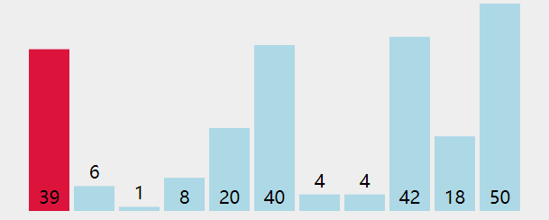
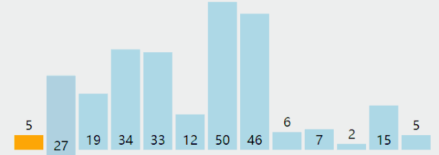

# handmade sort 手写排序算法

## 冒泡排序

### 代码
```javascript
    function bubbleSort(arr) {
        for (let i = 0; i < arr.length; i++) {
            for (let j = 0; j < arr.length - i - 1; j++) {
                let temp;
                if (arr[j] > arr[j + 1]) {
                    temp = arr[j];
                    arr[j] = arr[j + 1];
                    arr[j + 1] = temp;
                }
            }
        }
        return arr;
    }
```
## 选择排序

```javascript
    function selectionSort (arr) {
        const len = arr.length
        let min
        for (let i = 0; i < len - 1; ++i) {
            min = i /* 初始化未排序序列中最小数据数组下标 */
            for (let j = i + 1; j < len; ++j) { /* 访问未排序的元素 */
                if (arr[j] < arr[min]) { /* 找到目前最小值 */
                    min = j /* 记录最小值 */
                }
            }
            [arr[i], arr[min]] = [arr[min], arr[i]] /* 交换位置 */
        }
        return arr
    }
```

## 插入排序

### 代码
```javascript
    function insertSort(arr) {
        for (let i = 1; i < arr.length; i++) {
            let k = arr[i];
            let j;
            for (j = i - 1; j >= 0 && k < arr[j]; j--) {

                arr[j + 1] = arr[j]
                console.log(arr)
            }
            arr[j + 1] = k
        }
        return arr;
    }
```   

## reference
[手撕排序算法 ⭐](https://mp.weixin.qq.com/s/UHGj8noC8uAgp-no-UrJhQ)
